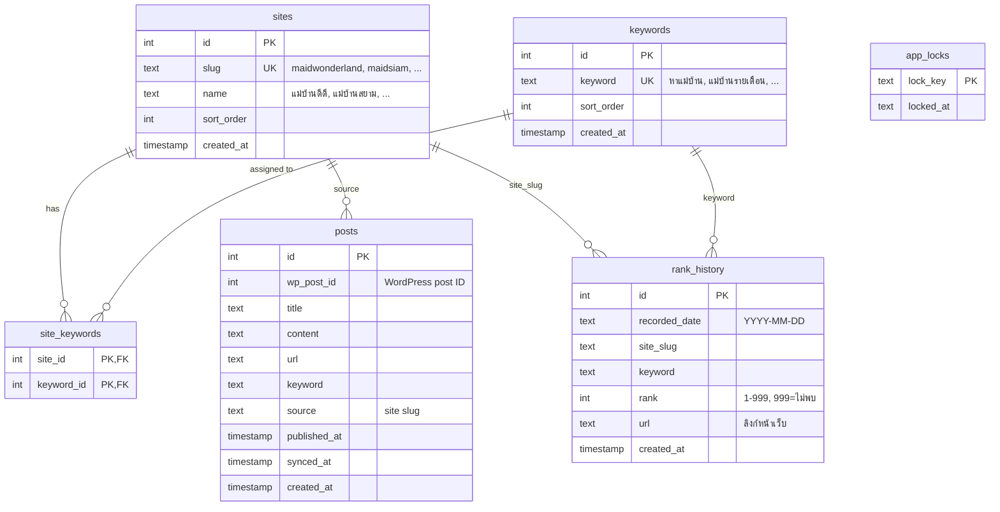

# ER Diagram - SEO System Database

เอกสารนี้อธิบาย Entity-Relationship ของฐานข้อมูล SEO System

---

## Entity Relationship Diagram

> **หมายเหตุ:** `posts` มี UNIQUE(title, source), `rank_history` มี UNIQUE(recorded_date, site_slug, keyword)

---

## Table Descriptions

### sites
6 เว็บไซต์ที่ระบบติดตาม

| Column | Type | Description |
|--------|------|-------------|
| id | SERIAL/INTEGER | Primary key |
| slug | TEXT UNIQUE | รหัสเว็บ (maidwonderland, maidsiam, nasaladphrao48, ddmaid, ddmaidservice, suksawatmaid) |
| name | TEXT | ชื่อภาษาไทย |
| sort_order | INTEGER | ลำดับแสดงผล |

### keywords
19 keyword หลักสำหรับ Ranking + หัวข้อบทความ

| Column | Type | Description |
|--------|------|-------------|
| id | SERIAL/INTEGER | Primary key |
| keyword | TEXT UNIQUE | คำค้น เช่น "หาแม่บ้าน", "แม่บ้านรายเดือน" |
| sort_order | INTEGER | ลำดับ |

### site_keywords
ผูก keyword กับ site (Many-to-Many) — บางเว็บอาจมี keyword เฉพาะ

| Column | Type | Description |
|--------|------|-------------|
| site_id | INTEGER FK | sites.id |
| keyword_id | INTEGER FK | keywords.id |
| PRIMARY KEY | (site_id, keyword_id) | |

### posts
บทความจาก 6 เว็บ ที่ดึงจาก WordPress API

| Column | Type | Description |
|--------|------|-------------|
| id | SERIAL/INTEGER | Primary key |
| wp_post_id | INTEGER | WordPress post ID |
| title | TEXT | หัวข้อบทความ |
| content | TEXT | เนื้อหา (ใช้คำนวณ similarity) |
| url | TEXT | ลิงก์บทความ |
| keyword | TEXT | (ถ้ามี) |
| source | TEXT | site slug |
| published_at | TIMESTAMP | วันที่เผยแพร่ |
| synced_at | TIMESTAMP | วันที่ sync ล่าสุด |
| created_at | TIMESTAMP | สร้างเมื่อ |
| UNIQUE | (title, source) | หัวข้อ+เว็บต้องไม่ซ้ำ |

### rank_history
บันทึกอันดับ Google ต่อ (วันที่, เว็บ, keyword)

| Column | Type | Description |
|--------|------|-------------|
| id | SERIAL/INTEGER | Primary key |
| recorded_date | TEXT | YYYY-MM-DD |
| site_slug | TEXT | เว็บ |
| keyword | TEXT | คำค้น |
| rank | INTEGER | อันดับ 1–20 หรือ 999 (ไม่พบ) |
| url | TEXT | ลิงก์หน้าที่เจอ |
| created_at | TIMESTAMP | บันทึกเมื่อ |
| UNIQUE | (recorded_date, site_slug, keyword) | 1 รายการต่อวันที่×เว็บ×keyword |

### app_locks
ล็อคป้องกันรัน job ซ้อน (เช่น rank check)

| Column | Type | Description |
|--------|------|-------------|
| lock_key | TEXT PK | ชื่อ lock |
| locked_at | TEXT | เวลาล็อค |

---

## Indexes

| Table | Index | Purpose |
|-------|-------|---------|
| posts | idx_posts_source_wp_post_id | UNIQUE (source, wp_post_id) WHERE wp_post_id IS NOT NULL |
| rank_history | idx_rank_history_keyword_recorded_date | query กราฟตาม keyword + ช่วง date |

---

## Database Support

- **SQLite** (default) — ไฟล์ `seo.db`
- **PostgreSQL** — ตั้ง `DATABASE_URL` ใน `.env`

 Schema รองรับทั้งสองแบบผ่าน `lib/db.ts` โดยแปลง SQL อัตโนมัติ (? → $1, $2, date functions ฯลฯ)
