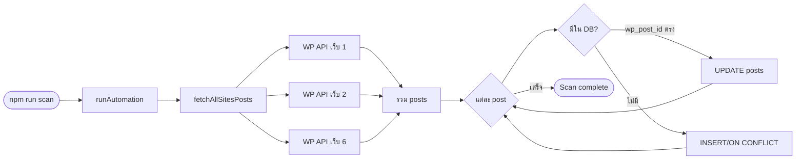
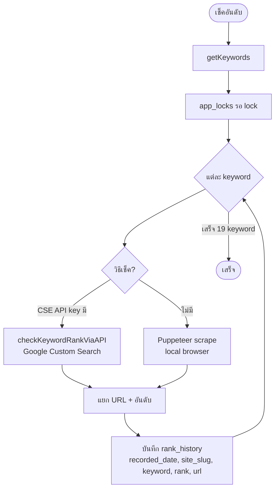
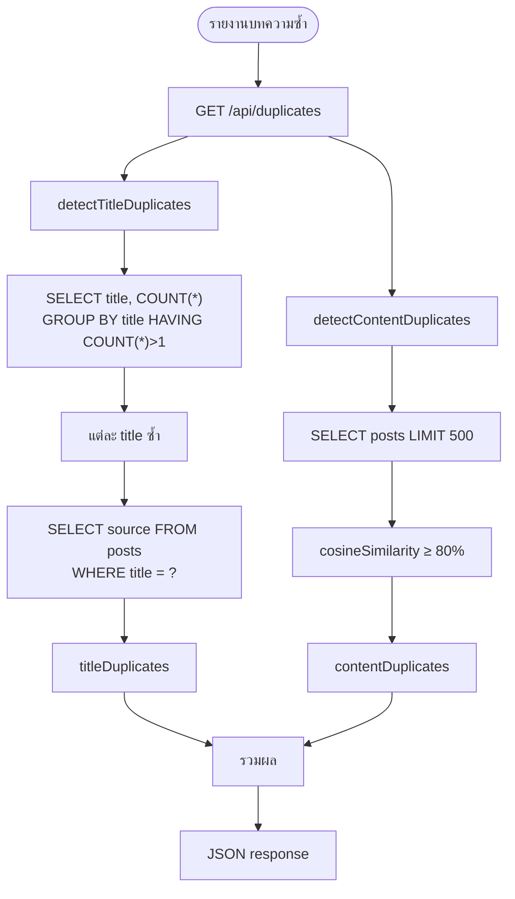
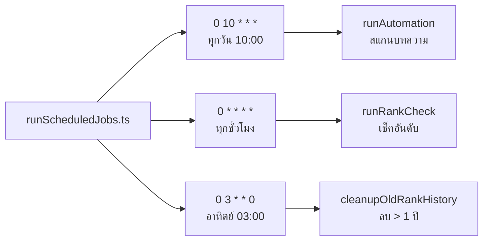

# Flow Charts - SEO System

เอกสารนี้อธิบาย flow หลักของระบบ SEO System ทั้งหมด

---

## 1. System Overview Flow

```mermaid
flowchart TB
    subgraph Input["แหล่งข้อมูล"]
        WP[WordPress API 6 เว็บ]
        Google[Google Search]
    end

    subgraph Automation["ระบบอัตโนมัติ (Cron)"]
        Scan[สแกนบทความ<br/>ทุกวัน 10:00]
        Rank[เช็คอันดับ<br/>ทุกชั่วโมง]
        Cleanup[ลบ rank_history เก่า 1 ปี<br/>อาทิตย์ละครั้ง]
    end

    subgraph Data["ฐานข้อมูล"]
        Posts[(posts)]
        RankHistory[(rank_history)]
        Keywords[(keywords)]
    end

    subgraph Dashboard["Dashboard"]
        Ranking[/ranking<br/>ตารางอันดับ]
        Graph[/ranking/graph<br/>กราฟแนวโน้ม]
        Titles[/article-titles<br/>หัวข้อบทความ]
        Duplicates[/duplicates<br/>รายงานซ้ำ]
        Manage[/ranking/manage<br/>จัดการข้อมูล]
    end

    WP --> Scan
    Scan --> Posts
    Google --> Rank
    Rank --> RankHistory
    RankHistory --> Cleanup

    Posts --> Titles
    Posts --> Duplicates
    Keywords --> Titles
    RankHistory --> Ranking
    RankHistory --> Graph
    RankHistory --> Titles
```

---

## 2. Article Scan Flow



---

## 3. Ranking Check Flow



---

## 4. Duplicate Detection Flow



---

## 5. Article Titles (หัวข้อบทความ) Flow

```mermaid
flowchart TB
    subgraph CheckTitle["ตรวจหัวข้อซ้ำ /article-titles"]
        UserInput[กรอกหัวข้อ]
        UserInput --> API1[GET /api/title-check?title=...]
        API1 --> TitleCheck[checkTitleSimilarity]
        TitleCheck --> Compare[calcSimilarity ≥ 60%<br/>เทียบกับ posts ทั้ง 6 เว็บ]
        Compare --> Result1[hasSimilar + matches]
    end

    subgraph Recommend["แนะนำหัวข้อ /api/recommend-titles-dropped-rank"]
        Request[GET recommend-titles]
        Request --> RankDrop[getRecommendationsFromDroppedRank]
        RankDrop --> Latest[อันดับล่าสุด rank_history]
        RankDrop --> Dropped[อันดับหล่น 2+ หน้า]
        RankDrop --> Templates[titleTemplates × keyword]
        RankDrop --> Filter[กรอง: ไม่ซ้ำข้ามเว็บ<br/>เว็บนาซ่า/สยาม/สุขสวัสดิ์ ไม่ใช้คนลาว]
        Filter --> Suggestions[TitleSuggestion[]]
    end
```

---

## 6. Cron Schedule Flow



---

## 7. Data Flow สำหรับกราฟ Ranking

```mermaid
flowchart LR
    Graph[ranking/graph] --> Fetch[useEffect]
    Fetch --> Latest[/api/ranking/latest]
    Fetch --> Keywords[/api/keywords]
    Fetch --> Sites[/api/sites]
    Fetch --> GraphAPI["/api/ranking/graph?keyword=&fromDate=&toDate="]

    Latest --> RankMap[latestRankMap]
    Keywords --> KeywordList[keywords array]
    GraphAPI --> GraphData[เส้นกราฟ 6 เว็บ]

    RankMap --> Heatmap[Heatmap สี]
    KeywordList --> Selector[เลือก keyword]
    Selector --> GraphAPI
```

---

## Scripts กับ Flow

| Script | Flow |
|--------|------|
| `npm run scan` | Article Scan Flow |
| `npm run schedule` | Cron Schedule Flow (รันทุก flow ตามเวลา) |
| `npm run detect` | Duplicate Detection (CLI) |
| `npm run check-ranking` | Ranking Check Flow (CSE API) |
| `npm run check-ranking-local` | Ranking Check Flow (Puppeteer) |
